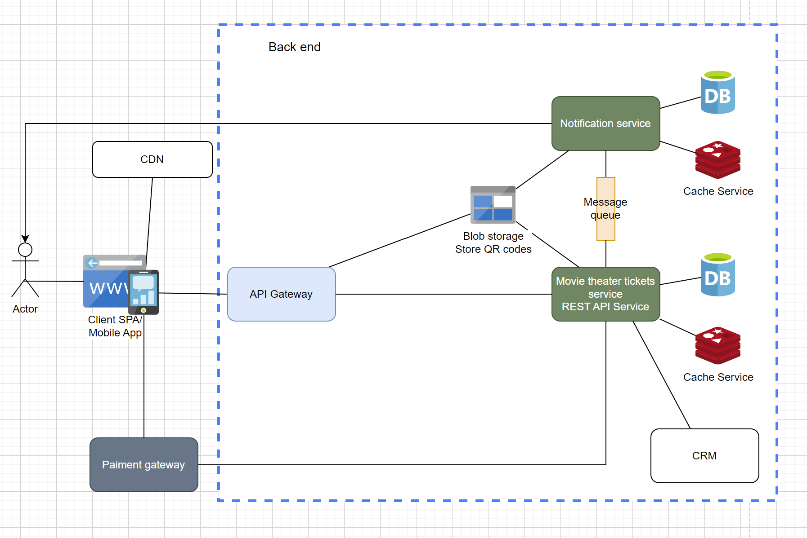
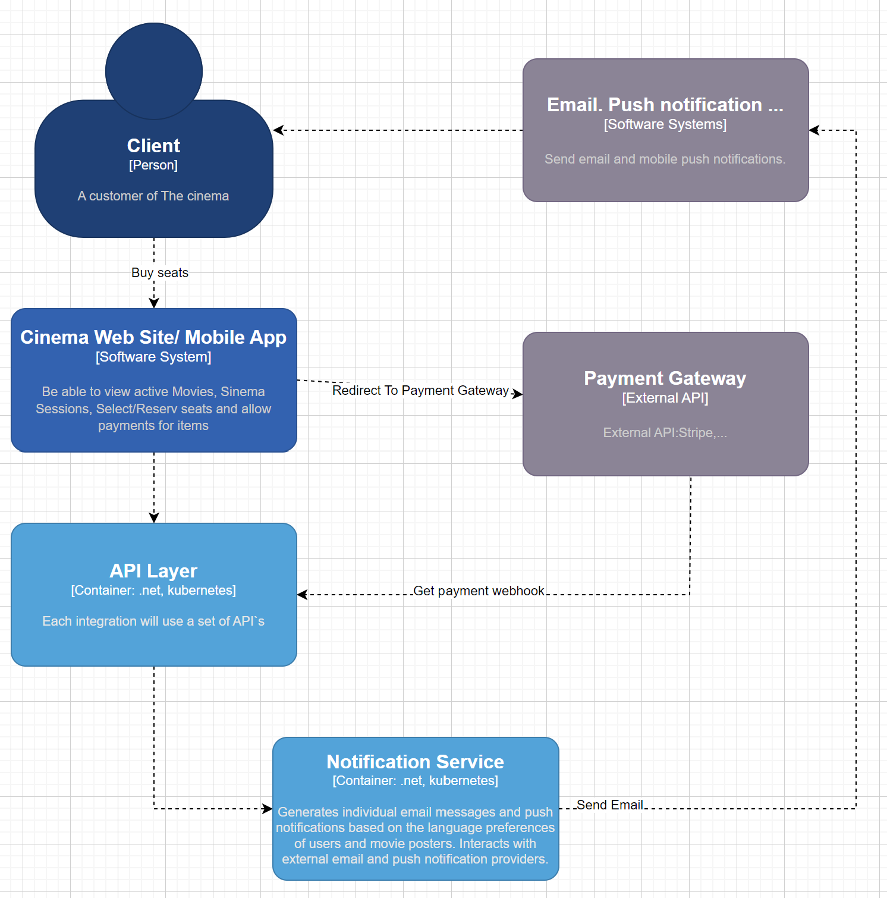
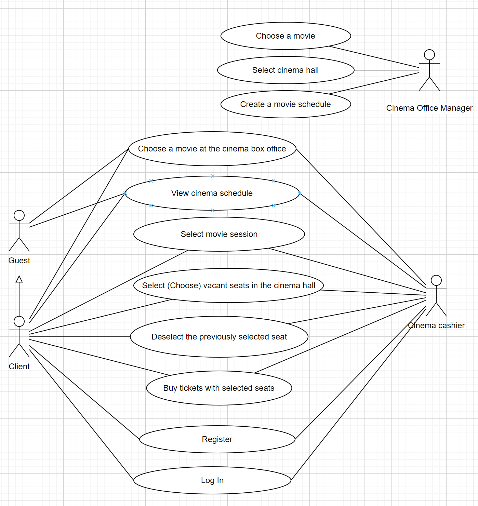

# Problem Description

## Problem Statement

The cinema chain intends "Come and watch" to transition to a hybrid ticketing model, incorporating both online and in-person sales. The current spreadsheet-based offline system has limitations such as duplicate sales and incompatibility with online platforms. A unified ticketing system will eliminate these issues, optimizing seat reservations and enhancing theater capacity utilization.

| Stakeholder           | Business Capability  | Business Problem/Concerns                                    |
| --------------------- | -------------------- | ------------------------------------------------------------ |
| Web site/Mobile App   | Sale                 | Sell place in active Movie Session online                    |
| Client                | Shopping Cart        | Client register online after adding times into the Shopping Cart |
| Client                | Account              | Secure login                                                 |
| Client                | Payment              | On checkout Shopping Cart – use secure payment gateway for payment (Stripe) |
| Client                | Communications Order | Automatically send ticket QR code after successful payment to customer |
| Cinema cashier        | Payment              | On checkout Shopping Cart – use secure payment gateway for payment (Credit Cart) or cash |
| Cinema Office Manager | Movie                | Add new movie                                                |
| Cinema Office Manager | Movie Session        | Create new Movie Session                                     |
| Cinema Office Manager | Stock Management     | Do not sell seats if the Movie Session is inactive or closed |

## Business Vision Statement

"Come and Watch" envisions a fully integrated ticketing system, optimized for cost-effective e-commerce website hosting, to cater to all ticket sales avenues.

## Change Drivers & Opportunities

- The primary business objective is to boost sales by offering online seat reservations through an e-commerce platform.
- The website must be user-friendly, fast, and fully responsive, facilitating easy access across various devices such as mobile phones, tablets, and PCs.
- "Come and Watch" has entered into a partnership with an external vendor for product delivery. The platform must therefore integrate seamlessly with the vendor's CRM APIs.
- Access to the website will be restricted to cities where "Come and Watch" cinemas are located.
- The platform should guarantee 24/7 uptime to accommodate varying user schedules.
- Development should adopt agile methodologies to ensure responsiveness to change.
- Customer data must be treated as confidential, and robust security measures need to be in place.

# Architecture Vision

The architecture aims to support the sale of hat products for The Funny Hat Shop through a robust e-commerce web application. The solution should adhere to the following architectural principles:

- Business Continuity: Include a disaster recovery plan to ensure system resilience.
- User-Friendliness: Opt for technology that is straightforward, easy to adapt, and intuitive for users.
- Data Security: Safeguard data both at rest and during transmission.
- Technology Independence: Design application components to be infrastructure-agnostic.

# Architecture Assumptions

# Constraints & Risks

| Risk                      | Mitigation                                                   | Owner              |
| ------------------------- | ------------------------------------------------------------ | ------------------ |
| Project Delay             | The business is open to hiring contractors to expedite development. | Business User      |
| High IT Operational Costs | The solution architecture will incorporate autoscaling capabilities to manage expenses. | Solution Architect |

# As-is Conceptual Architecture

To-Be Conceptual Architecture Diagram

## C4 Diagram

## Use case

For type of actors:

- Cinema Office Manager
- Cinema cashier
- Guest
- Client

# High-Level Non-Functional Requirements

## Availability 

- Solution should be highly available 24/7 with 99.99% availability 
- Batches are expected to run to check delivery status 
- Planned downtime for Monday mornings 1 to 2 hours only at 1am.

## Performance

- Solution should allowed for auto scalability on evenings, weekends and movie premiere 
- The web site response time should less than 2 seconds
- Allow for a thousand hit per day

## Volumes

- Product images are stored on AWS S3 Buckets for the stock management. Images are about
50kb average
- The Funny Hat Shop has 200 different products
- Allow for an initial 100gb of data storage with a 10% growth expected each year

## User Interactions

- The company expect 500 customer for the first 3 months, and 2000 after 12 months
- Allow for at least 10 concurrent users accessing the web site
- User locations should only be from America, Europe and South Africa

## Business Continuity

- Include backups with replication of the database
- Use multi availability zones in each region
- Customer data from that each country should be stored only in availability zones within
those country’s region

## Security

-  Client authentication and authorization should be facilitated through OAuth 2.0, using either Google or Facebook logins.
-  For Cinema Office Managers and Cashiers, authentication and authorization should be conducted via OAuth 2.0 using the internal Cognito service.
-  Ensure data security both at rest and in transit across all services.
-  Implement audit controls to monitor and log data changes.
-  Utilize X.509 certificates for securing the Web Application Container.

## Operations and Monitoring 

- Implement monitoring to assess the health of both the website and the database.
- The solution should incorporate exception handling and trigger alerts for any errors.

## Architectural Requirements

- Utilize a Kubernetes Cloud platform (AWS EKS, Azure AKS).
- Establish separate VPCs for Development, QA, UAT, and Production environments on Kubernetes.
- Specifics of the development stack will be outlined in the solution options document.
- Adopt a Microservices architecture by deploying solution components as containers.
- Implement DevOps pipelines to facilitate automated deployments, supporting Continuous Integration and Continuous Deployment.

[README](../README.md)

[Business Requirement](BusinessRequirement.md)

[Low-level architecture](MovieTheaterTicketsArchitecture.md)

