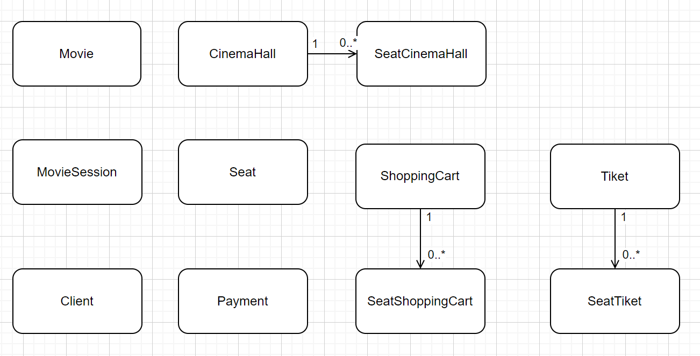
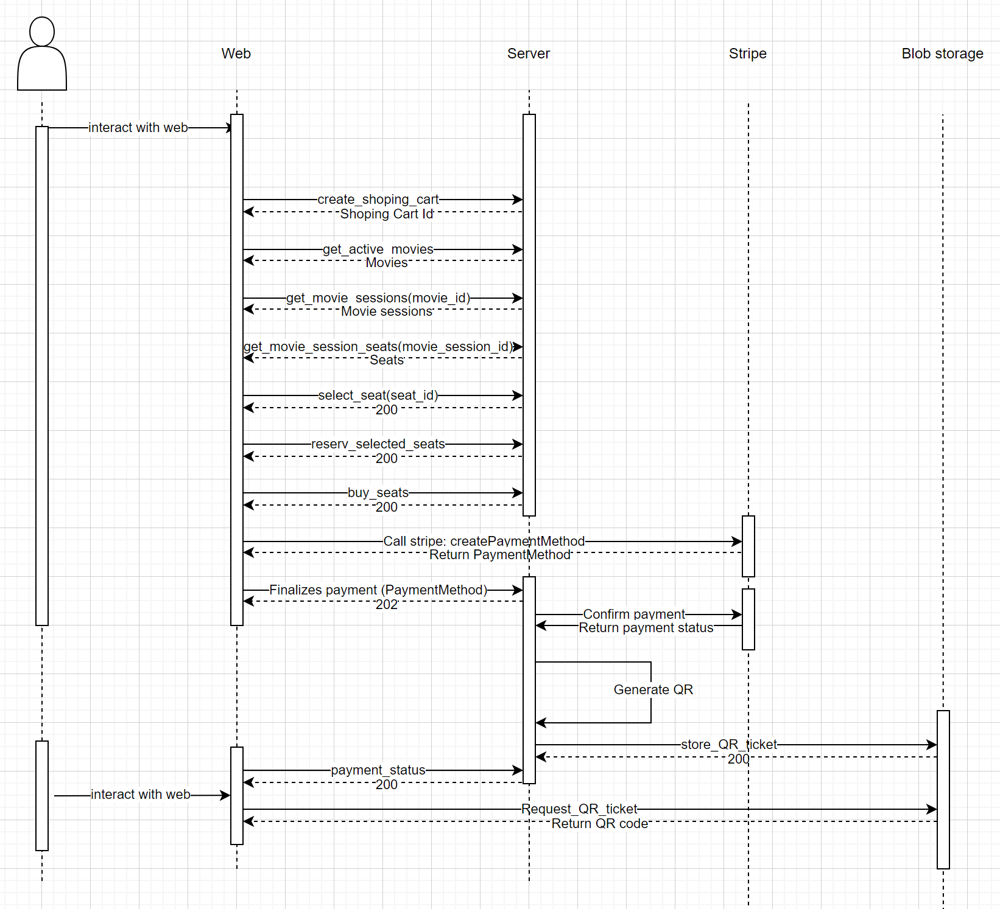
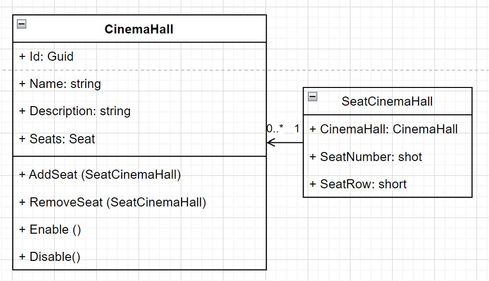
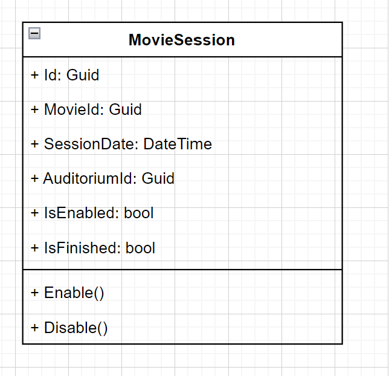
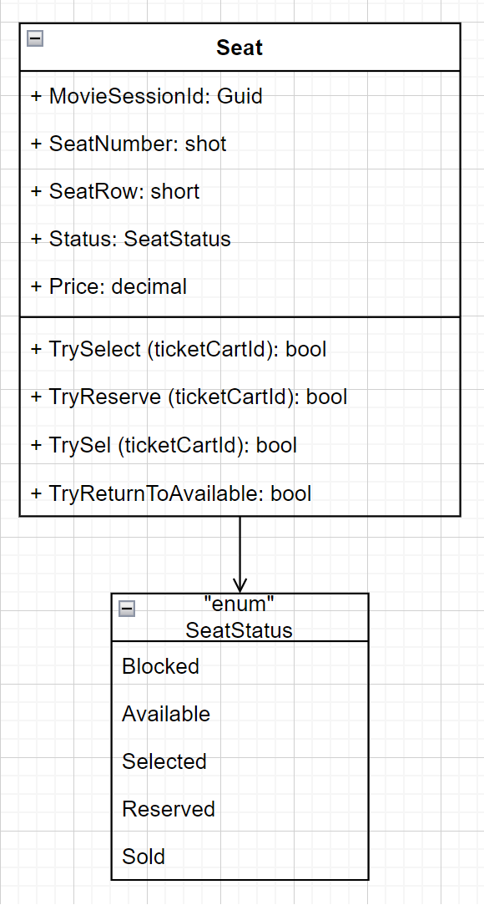
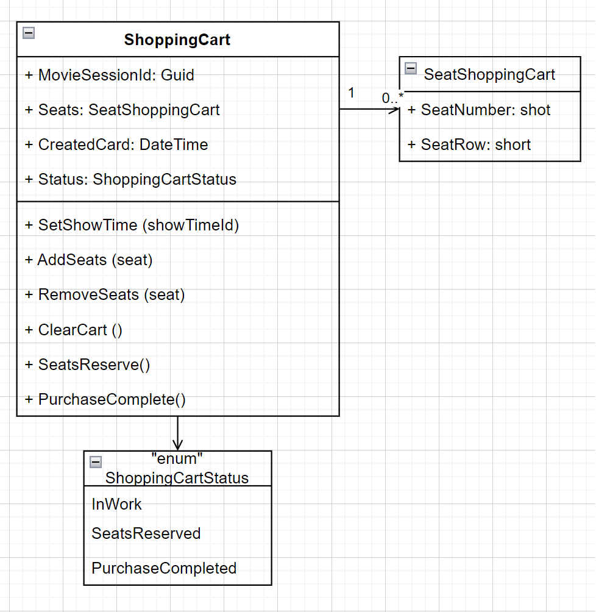

## Domains
The Core domain consists of the following subdomains.
The Seat in the Cinema Hall in a particular Movie Session is placed in a separate domain and is not an honor of the Movie Session. In this way, it is possible to implement a granular blocking of the Seat and not to block the Movie Session when the seat is selected.

## Sequence Diagram
The interaction between user and system can be depicted in the following sequence diagram.

# Class Diagram

### Cinema Hall

### 

### Movie Session

### Seat

### Shopping Cart

# API

## Movie

GET /api/movies/{movieId}

GET /api/movies

POST  /api/movies

PUT  /api/movies/{movieId}

## Movie Sessions

GET /api/moviesession/{movieSessionId}/seats

POST /api/moviesession

GET /api/moviesession

PUT /api/moviesession/{movieSessionId}

GET /api/moviesession/{movieSessionId}

GET /api/movies/{movieId}/moviesessions

## Shopping Carts

POST /api/shoppingcarts

POST /api/shoppingcarts/{shoppingCartId}/seats/select

DELETE /api/shoppingcarts/{shoppingCartId}/seats/unselect

POST /api/shoppingcarts/{shoppingCartId}/reservations

DELETE /api/shoppingcarts/{shoppingCartId}/unreserve

POST /api/shoppingcarts/{shoppingCartId}/purchase

GET /api/shoppingcarts/{shoppingCartId}

[README](../README.md)

[Business Requirement](BusinessRequirement.md)

[IT Architecture Vision](ITArchitectureVision.md)